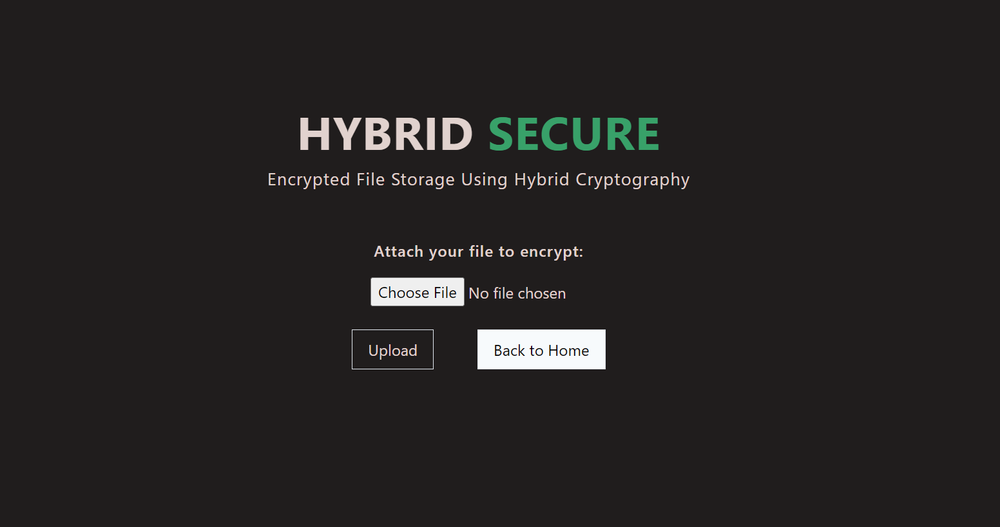

# File Storage Using Hybrid Cryptography

## Backend 
### Python

## Frontend
### React, JavaScript, HTML5, CSS3

 

## About 
This is a local file encryption platform designed to provide robust security and privacy for sensitive files.

#### Why to use it?
After the encryption process, users gain enhanced data security and control over their files. The encrypted files are protected against unauthorized access, ensuring the confidentiality of sensitive information. It can be used for:

*Secure Storage*: Encrypted files can be stored in various locations, including local storage, cloud services, or external devices, without the fear of data exposure in case of unauthorized access.

*Data Transfer*: Encrypted files can be safely transferred over networks or shared with others. Even if intercepted, the encrypted content remains indecipherable without the appropriate decryption keys.

*Backup*: Encrypted files can be included in backup routines, providing an added layer of security during data backup processes.

*Cloud Services*: Encrypted files can be uploaded to cloud storage services, enhancing data protection even when stored remotely.

*Collaboration*: Encrypted files can be shared with authorized collaborators. Only those with the necessary decryption keys can access the original content.

It is like a digital vault for your important files, ensuring they stay safe and private. Imagine it as a combination of a lock and a secret code. First, we divide big files into smaller parts, sort of like putting a puzzle into pieces. Then, we lock each piece using a special code that only you and your recipient know. This special code is like your personal key. Later, when you want to see your files again, we use your key to unlock and put all the puzzle pieces back together exactly as they were. This keeps your files private and intact, giving you peace of mind when storing and sharing sensitive information.

 

# Installation

Step 1: Install Requirements 
`pip install -r requirements.txt` 

Step 2: Run the application 
`python3 app.py` or try `python app.py` 

Step 3: Visit the localhost on your browser 

# Hybrid Cryptography
Hybrid cryptography is a method that combines the advantages of both symmetric and asymmetric encryption to achieve secure data transmission and storage. In the code:

Symmetric Encryption: AES encryption is used for file encryption (AESAlgo, AESAlgoRotated, AESGCMAlgo, AESCCMAlgo). Symmetric encryption is efficient for bulk data encryption.

Asymmetric Encryption: RSA encryption is used for encrypting the keys (RSAAlgo). The keys used for symmetric encryption are encrypted with the recipient's public key (asymmetric encryption) before storage.

By combining both symmetric and asymmetric encryption techniques, the code achieves the benefits of both: efficient encryption using symmetric cryptography and secure key exchange using asymmetric cryptography. This hybrid approach enhances data security and minimizes performance overhead.

### Encrypter.py
Thia demonstrates a hybrid cryptography approach to secure data encryption. Here's a breakdown of how it uses hybrid cryptography:

*Symmetric Encryption (AES)*: The code uses the Fernet library to perform AES encryption in various modes like CBC, GCM, and CCM. AES is a symmetric encryption algorithm known for its efficiency in bulk data encryption. It secures the content of files by encrypting them with randomly generated symmetric keys (key_1_1, key_1_2, key_2, key_3, key_4). These keys are used to encrypt different parts of the data.

*Asymmetric Encryption (RSA)*: The RSA algorithm is used for secure key exchange and protection. The code generates an RSA key pair (private and public keys) for each encryption process. The generated keys allow encryption and decryption without sharing the same key. The RSAAlgo function demonstrates the use of asymmetric encryption, where the keys used for symmetric encryption are encrypted using both the sender's (my_private_key) and receiver's (your_public_key) public keys. This ensures that only the intended recipient can access and decrypt the encrypted symmetric keys, adding an extra layer of security.

*Combining Techniques*: The AESAlgoRotated, ChaChaAlgo, AESGCMAlgo, and AESCCMAlgo functions apply different symmetric encryption algorithms. These algorithms are rotated in a round-robin manner for different files, creating a diverse encryption environment. This practice enhances security by mitigating vulnerabilities associated with using a single encryption method.

*Key Storage and Distribution*: The code writes the encrypted symmetric keys (encryptedKeys) to a file (store_in_me.enc), protecting them with AES encryption using key_1. Additionally, the Main_Key.pem file is created, containing key_1, which is used for decryption purposes. This separation of encryption and decryption keys is a characteristic of hybrid cryptography.

By combining symmetric and asymmetric encryption methods in different steps of the process, the code demonstrates a hybrid cryptography approach that effectively secures data, prevents unauthorized access, and ensures efficient transmission and storage.

### Decryptor.py
*Key Retrieval* The decryption process begins with retrieving the private key used for decryption. This key corresponds to the public key used during encryption and is necessary to unlock the encrypted symmetric keys.

*Symmetric Key Decryption* The encrypted symmetric keys are stored in the "store_in_me.enc" file. The readEncryptedKeys function is responsible for reading these keys.

*Hybrid Decryption Approach* The private key is then used to decrypt the encrypted symmetric keys. This step is performed by calling the AESAlgo function, which uses the private key to decrypt the encrypted keys.
The symmetric keys obtained from decryption are a combination of multiple keys for different algorithms.

*Algorithm Identification and Decryption* The symmetric keys are extracted and split using the delimiter ":::::". These keys correspond to different encryption algorithms used during encryption.
For each encrypted file fragment, the corresponding decryption algorithm is determined based on metadata or patterns established during encryption.

*File Restoration* The specific decryption algorithm is selected, and the decrypted symmetric key associated with that algorithm is used.
The AESAlgoRotated, ChaChaAlgo, AESGCMAlgo, and AESCCMAlgo functions are called based on the algorithm identified for each file fragment.
These functions decrypt the encrypted file content using the appropriate decryption algorithm and the decrypted symmetric key.
The decrypted content is then written to individual files in the "files" directory.

*File Reassembly and Restoration* Once all file fragments have been decrypted and restored, the individual fragments are reassembled in the correct order to recreate the original file.
The restored file is now available for download or further use.

*Data Integrity Check* The Hybrid Cryptography approach ensures that the decrypted and restored file maintains data integrity and remains accurate.

*Conclusion* The decryption process effectively reverses the encryption applied during the encryption process, allowing for the restoration of encrypted files to their original form.
Please note that the code provided is part of a broader decryption module, and the explanation focuses on how the code handles the decryption process using the Hybrid Cryptography approach. The decryption module interacts with other modules and components, such as key retrieval and file reassembly, to achieve the overall goal of restoring encrypted files.

### Divider.py
*File Selection*: The process begins by selecting a file from the "uploads" directory for division. The chosen file's name is recorded for metadata purposes.

*Chapter Size and Buffer Management*: Files are divided into chapters, each with a predetermined maximum size. This approach enhances operational efficiency and prevents memory overloads.
The code uses variables like MAX (chapter size) and BUF (memory buffer size) to manage the file division process effectively.

*Chapter Creation and Metadata*: As the file is read, chapters are created by extracting content up to the specified chapter size. Each chapter is stored in a separate file within the "files" directory.
Metadata about the original file's name and the total number of chapters is recorded in the "meta_data.txt" file within the "raw_data" directory.

*Buffering Strategy*: During chapter creation, an "uglybuf" is used to manage data that may exceed the current chapter size. This approach ensures that content isn't lost between chapters.

*Chapter Naming Convention*: Chapters are named using a consistent naming convention, such as "SECRET000001," "SECRET000002," and so on. This convention aids in organized storage and later reassembly.

*Conclusion*:The file division process, implemented in the "divider" module of the Hybrid Cryptography Data Protection Framework, plays a crucial role in optimizing data handling for subsequent encryption and decryption. By breaking large files into smaller chapters and preserving essential metadata, this module contributes to an efficient and organized approach to securing and managing sensitive data.

### Restore.py
The "restore" function uses various functions from the "tools" module to automate the file restoration process. The first step in the process is to empty the 'restored_file' folder using the "empty_folder" function. This ensures that the folder is empty and ready to receive the restored file.

Next, the function reads metadata from a file called 'meta_data.txt' using the "open" function and the "read" method. The metadata contains information about the original file, including the file name and the number of chapters created when the file was split. The metadata is stored in a list called "meta_info".

After reading the metadata, the function creates a file path for the restored file using the original file name obtained from the metadata. The file path is constructed by concatenating the string 'restored_file/' with the original file name obtained from the metadata.

Once the file path has been created, the function reads binary data from a list of files in the 'files' folder. The list of files is obtained using the "list_dir" function from the "tools" module. The function sorts the list of files alphabetically using the "sorted" function to ensure that the file chapters are read in the correct order.

The function then uses a nested "with" statement to open each file in the list and read its binary data. The binary data is read using the "read" method, which reads the entire contents of the file at once. The binary data is then written to the new file at the specified file path using the "write" method. The "write" method writes the binary data to the file in a single step.

Once all the file chapters have been read and written to the new file, the 'files' folder is emptied using the "empty_folder" function from the "tools" module. This ensures that the folder is empty and ready to be used for future file restorations.

The restoration process is an essential component of the project on hybrid cryptography. Splitting files into multiple parts and restoring them can help secure data, prevent unauthorized access, and ensure efficient transmission and storage. 

